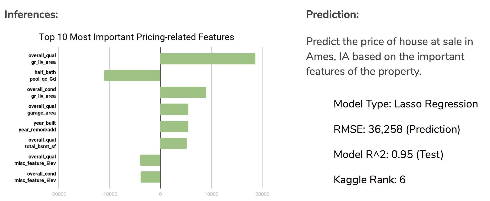

# Ames House Pricing Prediction (Kaggle Challenge)

In this project, I created a regression model based on the Ames Housing Dataset. This model will predict the price of a house at sale.

**Target:**
House price in Ames, IA (sale_price is a continuous variable)

**Problem Type:**
Regression & Predictions

**My Workflow:**
1. Inferences: Get knowledge of the most important price-related features of the property that people care about when buying a house in Ames, IA
2. Predictions: Predict the price of house at sale in Ames, IA based on the important features of the property

**Result:**

**Note:**
1. Code.ipynb: my notebook
2. Presentation.pdf: my presentation deck
3. Kaggle challenge page: [KagglePage](https://www.kaggle.com/c/dsi-us-4-project-2-regression-challenge)